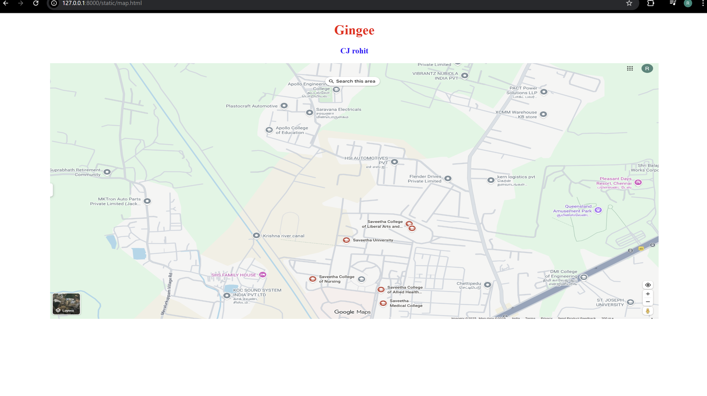
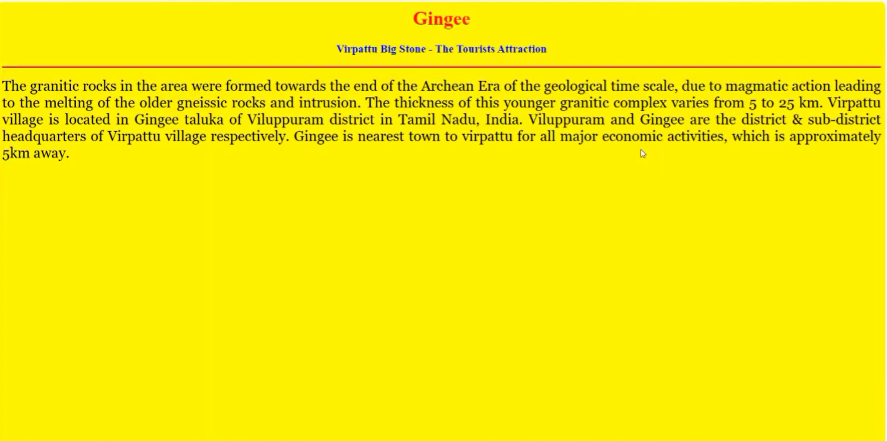

# Ex04 Places Around Me
## Date: 

## AIM
To develop a website to display details about the places around my house.

## DESIGN STEPS

### STEP 1
Create a Django admin interface.

### STEP 2
Download your city map from Google.

### STEP 3
Using ```<map>``` tag name the map.

### STEP 4
Create clickable regions in the image using ```<area>``` tag.

### STEP 5
Write HTML programs for all the regions identified.

### STEP 6
Execute the programs and publish them.

## CODE
```
map.html 

<!DOCTYPE html>
<html>
<head>
    <title>My City</title>
</head>
<body>
    <h1 align="center">
        <font color="red"><b>Gingee</b></font>
    </h1>

    <h3 align="center">
        <font color="blue"><b>CJ rohit</b></font>
    </h3>

    <center>
        
        <map name="MyCity">
            <!-- Rectangle area linking to home.html -->
            <area shape="rect" coords="100,100,900,950" href="home.html" title="My Home Town">
            <!DOCTYPE html>
<html>
<head>
    <title>My City</title>
</head>
<body>
    <h1 align="center" style="color:red;">Places Around My House</h1>
    <center>
        
        <map name="MyMap">
            <area shape="circle" coords="50,80,150,180" href="circle.html" title="My Home">
            <area shape="rect" coords="300,200,50" href="rect.html" title="My School">
 
        </map>
    </center>
</body>
</html>

        </map>
    </center>
</body>
</html>
   
   circle.html 
   <!DOCTYPE html>
<html>
<head>
    <title>My Home</title>
</head>
<body>
    <h2>My Home</h2>
    <p>
        My home is located in a peaceful neighborhood surrounded by greenery. 
        It is the place where I spend quality time with my family and friends. 
        The environment is calm, and the mornings are filled with the sound of birds. 
        It’s truly my favorite place in the world.
    </p>
    <a href="/">Back to Map</a>
</body>
</html>
   
   rect.html

   <!DOCTYPE html>
<html>
<head>
    <title>Public Library</title>
</head>
<body>
    <h2>Public Library</h2>
    <p>
        The public library near my house is a quiet and inspiring place filled with knowledge. 
        It has hundreds of books on various subjects, including science, history, and literature. 
        I often visit during weekends to read and complete my assignments. 
        The library also provides computer access and a reading area that encourages learning. 
        It’s truly a treasure for all book lovers in my neighborhood.
    </p>
    <a href="/">Back to Map</a>
</body>
</html>

```

## OUTPUT





## RESULT
The program for implementing image maps using HTML is executed successfully.
